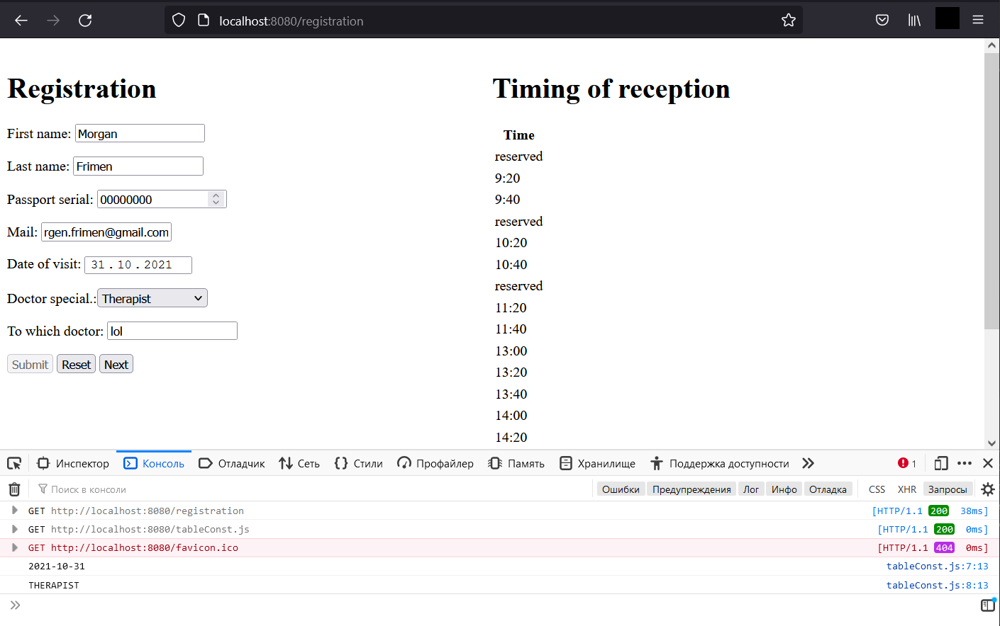
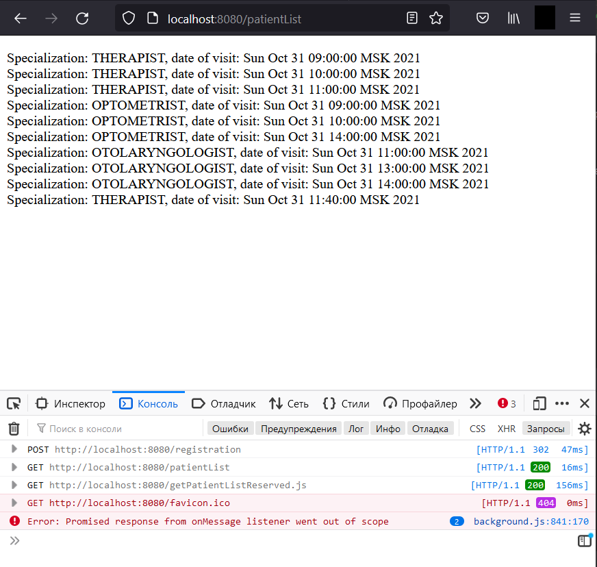
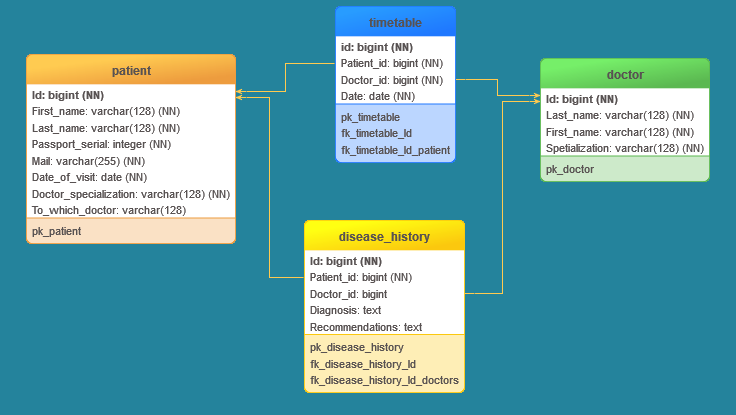

# Проект по созданию системы самозаписи в медицинскую клинику
_____________________________________________________________

### 3. Adding to the project JDBC
	На момент написания readme версия приложения 0.1.4
	
	В проекте реализованно взаимодействие с бд PostgreSQL через Spring JDBC познее возможно будет заменено на JPA
	В корневой папке проекта хранится файл docker-compose.yml который используется для создания нужной версии БД с минимальными настройками
	Так же в папке ./src/main/java/resouces/schema/ хранится файл schema.sql в котором описана стрктура таблиц и некоторое количество
	тестовой информации для заполнения таблиц
	
	На данный момент через браузер можно выполнить запросы:
	http://localhost:8080/patients			- Возвращает файл json в котором указанны все пациенты
	http://localhost:8080/patients/{id} 	- Возвращает файл json в котором указан пациент с запрошенным id
	http://localhost:8080/doctors			- Возвращает страницу html в которой содержится таблица с имя/фамилия/специализация врачей
	
	Для работы с запросами созданны классы (для каждой сущности) реалезующие интерфейс RowMapper и DAO соответственно

### 2. Creating a repository with reserved data
	Создание системы и методов хранения дат записей в трехмерном массиве расценена как не перспективная.
	Создается репозиторий где будут храниться зарезервированные данные.
	Для каждой записи будет использоватся сущность Recording которая содержит два поля дату/время записи и специализацию врача.
	Сущности хранятся в списке. По предварительным расчетам если хранить неактуальные записи (например вчерашний день) то кол-во 
	записей составит 365 (дней) * 20 (максимальное количество пациентов в день) * 3 (количество специализаций) = 21900.
	На момент написания данного текста форма для регистрации имеет только два обязательных поля это дата приема и специализация
	врача. Специализации предоставленны в виде выпадающего списка где по умолчанию выбран терапевт. Сохранение ранее вводимых 
	данных разрешено.
	
	На момент написания readme версия приложения 0.0.21
	
	Порядок действий примерно такой: 
	Регистрационная форма запускается по адресу  http://localhost:8080/registration
	Форма реалезует поля класса Patient1 который будет создаватся из PatientForm.
	PatientForm это промежуточный класс между формой  и сущностью.
	PatientServiceController обладает методами
		patientList() - возвращает страницу со списком всех зарезервированных дат с указанием специализации врача
		patientFrom() - предоставить страницу с формой регистрации
		savePatient() - сохранение записи о приеме в репозиторий
		testGetRecord() - данный метод предоставляет список зарезервированного времени для конкретной даты
		returnRecord() - возвращает список String где указана дата/время приема и специализация врача
	
	1) На сервер  посылается запрос на регистрацию http://localhost:8080/registration
	2) Запрос обрабатывает контроллер patientFrom(), он вызывает форму регистрации page.html
	3) На данный момент валидация присутствует в поле "Date of visit" это поле обезательно для заполнения, так же в поле "spec" которое
	будет передаватся в "doctorSpetialisation" выбрано значение по умолчанию "Терапевт"
	4) Нажимая "Next" вызывается JavaScript "tableConst", проверяем задана ли дата
	5) Из скрипта делаем запрос с контроллеру http://localhost:8080/getRecord/ этот запрос будет обработан testGetRecord()
	Смысл в том что в данный контроллер пердается дата (в формате "yyyy-MM-dd" формат String и строка с специализацией доктора)
	контроллер вызывает из репозитория метод getRecord(). Данный метод перебирает сохраненные в нем даты (зарезервированные даты/часы
	приема). Перебор идет по трем параметрам год, месяц, день. Познее планирую улутшить данныей метод что бы вызывался один параметр
	а не три.
	6) Получив список (а получаем мы список строк "yyyy-MM-dd HH:mm" который будет приводится к формату Date) в tableConst.js 
	вызывается getTableHtml().
	В данном методе создается визуальное представление таблицы в которой буду указано "свободное" время. В таблице будут строки вида
	"9:00 ... 16:20" или reserved. 
	Создание данной таблицы происходит в цикле.  Сравнивается "время" которое получается из списка предоставленным контроллером,
	методом testGetRecord() и массивом arrTime[] который сохранен в скрипте. 
	Из массива дат (предоставленных testGetRecord()) после приведения типов извлекается час + минуты и сравнивается с расписанием,
	если совпадение то вместо времени на которое можно записаться ставим запись reserved.
	Если совпадения не произошло то размещаем в теге возможность вызова метода который должен передать значение из себя (это время 
	например 16:20) в месте с датой в форму в поле ${dateOfVisit}.
	7) Нажимая на "любое удобное время" (из предоставленых) Вызывается функция "oneClick" в которой создается полная дата для регистрации
	например "2021-10-31 13:00" и вместе с специализацией врача передается обратно в форму на странице.
	8) Становится доступна кнопка Submit, нажимая на нее поля передаются в PatientForm. Происходит проверка на то что значения даты и 
	специализации врача не пустые. Создается экзкмпляр Patient1 в него передаются поля из PatientForm. 
	9) Если поле даты не пустое то происходит сохранение даты в репозитории.
	10) При удачном завершении всех этапов отобразится страница где будут отображены все зарезервированные записи.
	




### 1. Stage one
	Постановка задачи.
	Написать систему самозаписи в медицинскую клинику. Пациенты записываются на прием к врачам (познее добавить запись на исследования). У врачей будет 
	имется расписание когда они дежурят, врачи имеют разную специализацию. В данной реализации будут присутствовать по 4 врача, на каждую из 3 специализаций.
	Есть конкретный врач, либо общее расписаниеие (для записи на ближайшее число, врач по выбранной специальности ближайший свободный). Талон высылается
	на почту.
	В расписании будут использоватся фиксированное время. Нельзя будет записать двух человек на одно и то же время. В день на каждлго врача может быть 
	записанно не более 20 пациентов. Врачи работают с 9 до 17 часов следовательно (если вычесть час на обед) на каждого пациента выделяется по 20 минут. 
	Предварительно в БД (Регистрация в мед.клинику) будет содержатся три таблицы "Пациент", "Врач", "Расписание".
```sql	
	CREATE TABLE doctor
	(
		Id BIGINT PRIMARY KEY,
		Last_name VARCHAR(128) NOT NULL,
		First_name VARCHAR(128) NOT NULL,
		Specialization VARCHAR(128) NOT NULL
	);

	CREATE TABLE patient
	(
		Id BIGINT PRIMARY KEY,
		First_name VARCHAR(128) NOT NULL,
		Last_name VARCHAR(128) NOT NULL,
		Passport_serial INTEGER NOT NULL,
		Mail VARCHAR(255) NOT NULL,
		Date_of_visit TIMESTAMP NOT NULL,
		Doctor_specialization VARCHAR(128) NOT NULL,
		To_which_doctor VARCHAR(128)
	);

	CREATE TABLE timetable
	(
		Id BIGINT PRIMARY KEY,
		Patient_id BIGINT NOT NULL,
		Doctor_id BIGINT NOT NULL,
		Date TIMESTAMP NOT NULL,
		FOREIGN KEY (Patient_id) REFERENCES patient (Id),
		FOREIGN KEY (Doctor_id) REFERENCES doctor (Id)
	);

	CREATE TABLE disease_history
	(
		Id BIGINT PRIMARY KEY,
		Patient_id BIGINT NOT NULL,
		Doctor_id BIGINT NOT NULL,
		Diagnosis TEXT,
		Recommendations TEXT,
		FOREIGN KEY (patient_id) REFERENCES patient (Id),
		FOREIGN KEY (doctor_id) REFERENCES doctor (Id)
	);
```



#### Questions and comments 
	Как пациент увидит какое время доступно для записи у конкретного врача?
	
	Создание терехмерного массива со значениями тру фолз (запись совершена / запиь свободна)
	этот массив должен быть сериализован, чтобы если сервер упадет, данные о произведенных записях не нужно было 
	считывать с бд. Касательно структуры данных будет лутше использовть массив с вложенными масивами.
	На каждый день расписание фиксированно как следствие создаем форму в которой указываем только время с 9:00 до 
	17:00 ссылки в этой форме обозначают структуру дня в котором есть свободное/занятое время.
	
	В сутках (двумерный массив) хранится массив с "интервалами для приема" которые длятся по 20 минут. И того за 
	один день таких интервалов (приемов пациентов) будет всего 20. следовательно всего 20 ячеек в массиве где
	хранится одно значение true или false что обозначает записался уже ктонибуть в этот день (true - записан, 
	false - свободно) на данный интервал либо нет.
	Трехмерный массив:
	boolean [месяц][день][интервалы времени для записи];
	Всего месецев 12. Так же должно быть созданна дополнителое решение для високосного года.
	
	месяца:
	[0] месяц Январь
	[1] месяц Февраль
	[2] месяц Март
	...
	[11] месяц Декабрь
	
	дни:
	[месяц n][0] день 1, n-ого месяца
	[месяц n][1] день 2, n-ого месяца
	[месяц n][2] день 3, n-ого месяца
	...
	[месяц n][30] день 31, n-ого месяца
	
	время будет поделенно примеро так:
	[месяц n][день n][0] время с 9:00 до 9:20, n-ого дня, n-ого месяца
	[месяц n][день n][1] время с 9:20 до 9:40, n-ого дня, n-ого месяца
	[месяц n][день n][2] время с 9:40 до 10:00, n-ого дня, n-ого месяца
	[месяц n][день n][3] время с 10:00 до 10:20, n-ого дня, n-ого месяца
	...
	[месяц n][день n][19] время с 16:20 до 16:40, n-ого дня, n-ого месяца
	
	boolean[][][] timetableDay;   //например октябрь запись на 4 число на 10:20 - 10:40
								  //цифра 9 обозначает октябрь т.к. нумерация в массиве начинается с 0
	dayAndTime[9][3][4] = false;  //свободно, тогда записываем
	dayAndTime[9][3][4] = true;   //это время занято, записатся на это время нельзя
	
	Добавление таблицы в которую будет записыватся диагноз и рекомендации по лечению
```sql
	CREATE TABLE disease_history
	(
		Id BIGINT PRIMARY KEY,
		Patient_id BIGINT NOT NULL,
		Doctor_id BIGINT NOT NULL,
		Diagnosis TEXT,
		Recommendations TEXT,
		FOREIGN KEY (patient_id) REFERENCES patient (Id),
		FOREIGN KEY (doctor_id) REFERENCES doctor (Id)
	);
```	